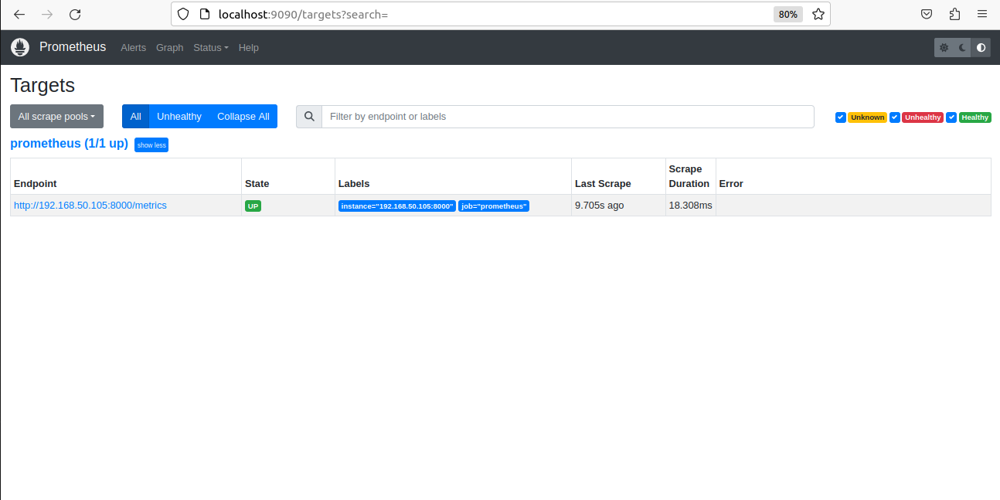

    Document version 1.2.2
    Domain: Public Repository
    Start Date: 10th September 2023
    Update Date: 10th Septemeber 2023

In this project we will create a node-js server using express framework. Then we will start monitoring that server.

Following headings are covered in that readme.
1. [What is Monitoring?](#1-what-is-monitoring)
2. [Tools for monitoring](#2-tools-for-monitoring)
3. [How to run Project](#3-how-to-run-project)

## 1. What is Monitoring?
Monitoring means tracking and observing servers health and operations running on it. We monitor our servers, so if any issue comes we can trace it. Monitoring is of two types
1. Metrics
2. Logs

### 1.1. Metrics
Metrics means tracking server health. Like how much RAM it is using, how much CPU usage and Storage usage.

### 1.2. Logs
Logs means maintaining logs information from code.


## 2. Tools for monitoring.
There are many tools available which monitor servers. But we will use following tools to monitor.

1. Prometheus
2. Grafana
3. Grafana Loki

### 2.1. Prometheus
Prometheus will cover _Metrcis_ monitoring. Prometheus client will generate metrics and we will create route /metrics which will send metrics outside. Then we will use Prometheus server. which will get data from metrics route in intervals. 
    
We will use Docker container of Prometheus server. Docker image for the following is 
    
***prom/prometheus***
    
and port used for that server is

***9090***

It will also need config (yaml) file. We will bind that volumne at

***/etc/prometheus/prometheus.yml***

After installing docker containers, you can test prometheus server running by visiting
localhost:9000/targets. There you will see it automatically calls the ip:port/metrics which we passed during configuration of prometheus server. Snap shot of it attached below


    

### 2.2. Grafana

Grafana is a GUI tool, which will provide use beautiful Visuals. We will connect Grafana server with prometeus server to display those values in beautifule graphs.

    Grafana will hold data for some days. Not permanent. Currently it is holding data for 15 Days.

Docker image used for grafana server is

***grafana/grafana-oss***
    
and port used for that server is

***3000***

    By default we have to set dashboard manually, but that is very time consuming, some buil in dashboards already available we will use them, more details we will cover later...

### 2.3 Grafana Loki
    (Logs monitoring server, Maybe we will not cover that in our project.)


## 3. How to run Project
To run project you will pre-required installation of following.

1. node with nvm
2. docker compose

Let's do configurations first of all.
* prometheus-server/prometheus.yml: place your ip at line number 20.

You can run node js server by following commands in terminal.

```
cd node-server
npm app.js
```

You can run required monitoring server by following commands in terminal.

```
#navigate to main project folder, if you currently in node-server
cd .. 
docker compose up -d
```

More steps will be added after doing some more work

---

_Created by: [Hammad Qureshi](https://github.com/qhammad99)_

---
If you found any issue, feel free to open issue. 
Thank you!
